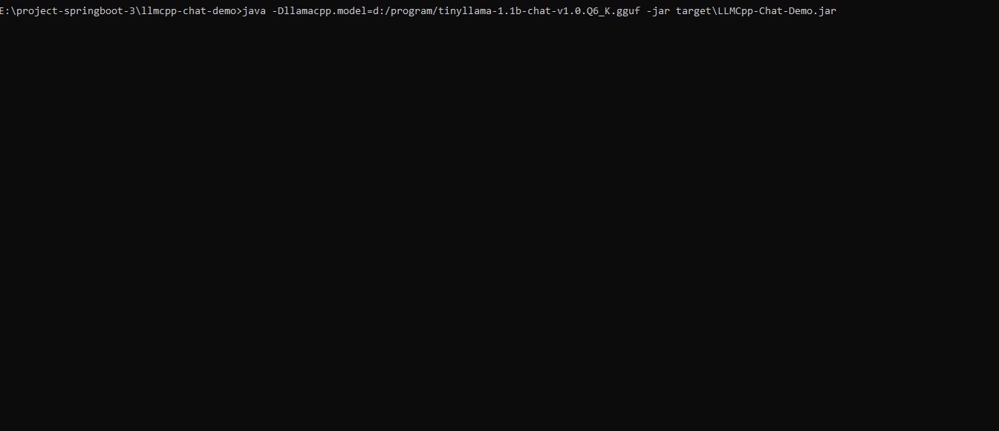

# LLMCpp Spring Boot Chat

This application showcases a straightforward LLM chat application developed with LlmCpp-Java and Spring Boot. This application uses Java 17+ and Spring Boot 3.

## Features

- CLI terminal to chat with LLM Model
- Dockerized


## Build
### Using Maven

- Download LLM GGUF model from huggingface or other source
- Use mvn package to build the module into jar file
```shell
mvn clean package
```
- The following command should be used to run the Java application
```shell
java -Dllamacpp.model=<path to gguf model> -jar <path to jar that is build from maven>
```

### Using Docker
- Download LLM GGUF model from huggingface or other source, and place the downloaded model in the "model" folder.
- Run docker build
```shell
docker build -t chat-cli .
```
- Run the docker image from previous step:
```shell
docker run -v <path to gguf file>:/app/llm-model.gguf -it chat-cli
```

## Parameters
The following parameters can be set when running this application:
| Parameter | Description | Default Value |
| --------- | ----------- | ------------- |
| llamacpp.prompt.path | Path of the prompt file | llamacpp_prompt.txt |
| llamacpp.temperature | Temperature settings of the model | 0.2 |
| llamacpp.topp | Control diversity of predictions | 10 |
| llamacpp.model | Path to the GGUF model | tinyllama-1.1b-chat-v1.0.Q6_K.gguf |
| llamacpp.thread.cpu | The number of CPU threads to use | 1 |
| llamacpp.number.context | Number of token context | 0 |


## Demo
Please find the application demonstration below.



## Feedback

For feedback, please raise issues in the issue section of the repository. Enjoy!!.

